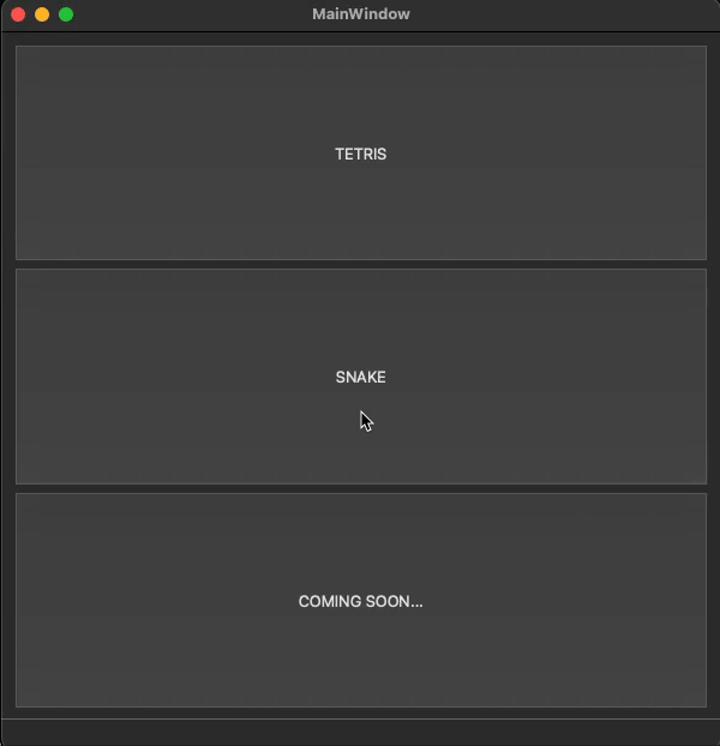
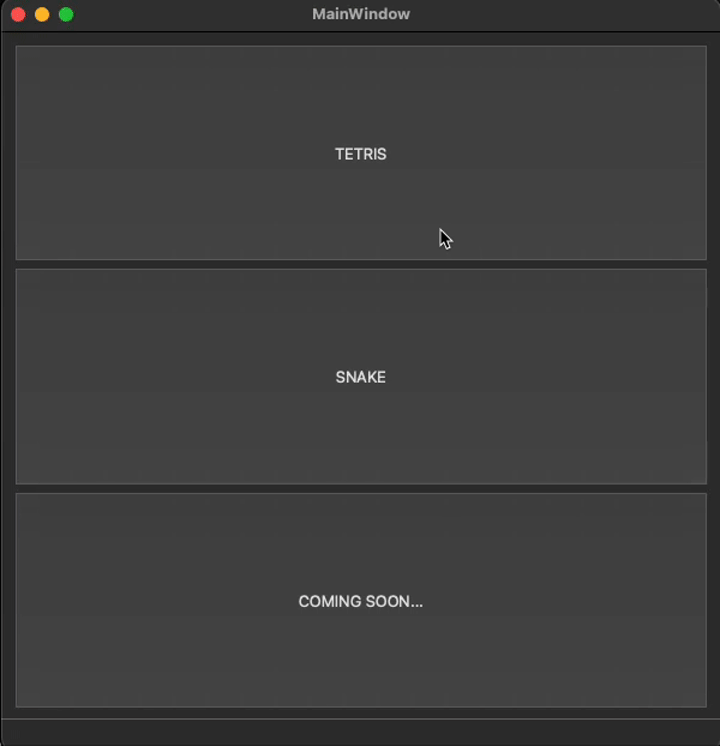
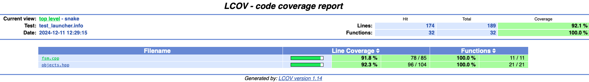
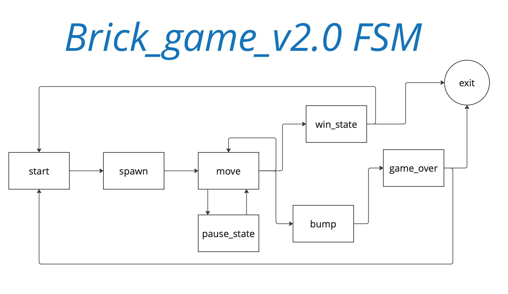

# BrickGame_v2.0

Реализовация игры «Змейка» на языке программирования С++ в парадигме объектно-ориентированного программирования.

## Содержание

1. [Введение](#введение)
2. [Змейка](#змейка)
3. [Спецификация](#спецификация)
4. [Управление](#управление)
5. [Сборка](#сборка)
6. [Запуск](#запуск)
7. [Юнит тесты](#юнит-тесты)
8. [LCOV report](#lcov-report)
9. [Документация](#документация)
10. [Создание дистрибутива](#создание-дистрибутива)

пример игры Змейка



пример игры Тетрис



## Введение

Проект состоит из двух отдельных компонентов: библиотеки, отвечающей за реализацию логики игры, и десктопного графического интерфейса.  
Разработанная библиотека подключена к консольному интерфейсу из BrickGame v1.0.  
Разработанная в BrickGame v1.0 игра «Тетрис» подключена к десктопному интерфейсу, разработанному в данном проекте.  

### Змейка

Игрок управляет змейкой, которая непрерывно движется вперед. Игрок изменяет направление движения змейки с помощью стрелок. Цель игры заключается в сборе «яблок» появляющихся на игровом поле. При этом игрок не должен касаться стенок игрового поля. После «поедания» очередного «яблока» длина змейки увеличивается на один. Игрок побеждает, если змейка достигает максимального размера (200 «пикселей»). Если змейка сталкивается с границей игрового поля, то игрок проигрывает.

## Спецификация

- Программа разработана на языке C++ стандарта C++17.
- Программа состоит из двух частей: библиотеки, реализующей логику игры змейка, и десктопного интерфейса.
- Для формализации логики игры использован конечный автомат.
- Библиотека соответствует спецификации, приведенной в первой части BrickGame ([ссылка](materials/library-specification.md)).
- Код библиотеки программы должен находится в папке src/brick_game/snake.
- Код с интерфейсом программы находится в папке src/gui/desktop.
- Библиотека, реализующая логику игры покрыта unit-тестам. Для тестов используется библиотека GTest. Покрытие библиотеки тестами составляет не меньше 80 процентов.
- Сборка программы настроена с помощью Makefile со стандартным набором целей для GNU-программ: all, install, uninstall, clean, dvi, dist, tests.
- Реализация с графическим пользовательским интерфейсом, на базе одной из GUI-библиотеки с API для C++17: Qt.
- Программа реализована с использованием паттерна MVC.
- Десктопный интерфейс поддерживает игру из проекта BrickGame v1.0.
- Консольный интерфейс поддерживает змейку.
- В игре змейка присутствовуют следующие механики:
  - Змейка должна передвигаться по полю самостоятельно, на один блок вперед по истечении игрового таймера.
  - Когда змейка сталкивается с «яблоком», ее длина увеличивается на один.
  - Когда длина змейки достигает 200 единиц, игра заканчивается победой игрока.
  - Когда змейка сталкивается с границей поля или сама с собой, игра заканчивается поражением игрока.
  - Пользователь может менять направление движение змейки с помощью стрелок, при этом змейка может поворачивать только налево и направо относительно текущего направления движения.
  - Пользователь может ускорять движение змейки зажатием клавиши действие.
  - подсчет очковю.
  - хранение максимального количества очков.
  - Каждый раз, когда игрок набирает 5 очков, уровень увеличивается на 1. Повышение уровня увеличивает скорость движения змейки. Максимальное количество уровней — 10.
- Начальная длина змейки равна четырем «пикселям».
- Игровое поле имеет размер 10 «пикселей» в ширину и 20 «пикселей» в высоту.
- Подготовь для сдачи проекта диаграмму, отображающую все состояния и переходы между ними для реализованного КА.

### Управление

- пауза (p)
- старт (enter)
- действие (space)
- перемещение или поворот (стрелки)

## Сборка

! важно: для сборки проекта требуется установленная библиотека QT версии > 5

- для сборки версии cli перейдите в `src` и выполните команду `make cli`
- для сборки десктопной версии перейдите в `src` и выполните команду `make desktop`
- для общей сборки выполните команду `make install`

проект собирается в папку `src/build`

### Запуск

- для запуска cli версии перейдите в `src/build/cli` и запустите `cli_launcher` из консоли
- для запуска desktop версии перейдите в `src/build/desktop` и запустите `brickgame.app`

## Юнит тесты

- перейдите в `src` и выполните команду `make test`

```bash
[----------] Global test environment tear-down
[==========] 20 tests from 4 test suites ran. (1009 ms total)
[  PASSED  ] 20 tests.
```

## LCOV report

- перейдите в `src` и выполните команду `make gcov_report`



## Документация

- перейдите в `src`
- сгенерируйте документацию командой `make dvi`

используемая модель FSM для змейки:



## Создание дистрибутива

- перейдите в `src`
- создайте дистрибутив командой `make dist`
- дистрибутив сохранится в `src/distribution`
